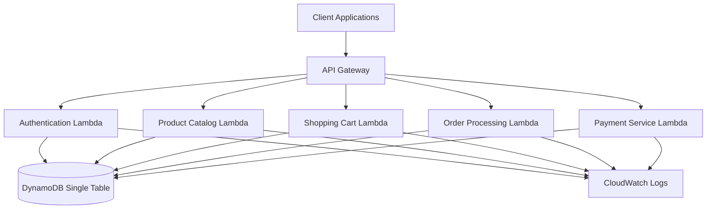

# Design Document: Z-Commerce AWS Lambda E-commerce Application

## Overview

Z-Commerce is a serverless e-commerce application built using AWS Lambda with Java 17, API Gateway, and DynamoDB. The system follows microservices architecture principles with each Lambda function handling specific business domains. The application demonstrates modern serverless patterns including single-table DynamoDB design, proper error handling, structured logging, and comprehensive testing strategies.

The architecture prioritizes educational value while maintaining production-ready patterns. Each component is designed to showcase AWS Lambda development best practices, Java-based serverless patterns, and NoSQL data modeling techniques.

## Architecture

### High-Level Architecture



### Service Architecture Principles

**Single Responsibility**: Each Lambda function handles one business domain (products, cart, orders, users, payments).

**Stateless Design**: All functions are stateless, storing state in DynamoDB between requests.

**Event-Driven**: Functions communicate through DynamoDB streams and direct API calls when needed.

**Fail-Fast**: Input validation occurs early in each function with clear error responses.

## Components and Interfaces

### Lambda Functions

#### 1. Product Catalog Service
- **Handler**: `com.zcommerce.products.ProductHandler`
- **Runtime**: Java 17
- **Memory**: 512 MB
- **Timeout**: 30 seconds
- **Operations**: 
  - `GET /products` - List all products
  - `GET /products/{id}` - Get product details
  - `POST /products` - Create product (admin)
  - `PUT /products/{id}` - Update product (admin)
  - `DELETE /products/{id}` - Delete product (admin)

#### 2. Shopping Cart Service
- **Handler**: `com.zcommerce.cart.CartHandler`
- **Runtime**: Java 17
- **Memory**: 256 MB
- **Timeout**: 15 seconds
- **Operations**:
  - `GET /cart/{userId}` - Get user's cart
  - `POST /cart/{userId}/items` - Add item to cart
  - `PUT /cart/{userId}/items/{productId}` - Update item quantity
  - `DELETE /cart/{userId}/items/{productId}` - Remove item from cart

#### 3. Order Processing Service
- **Handler**: `com.zcommerce.orders.OrderHandler`
- **Runtime**: Java 17
- **Memory**: 512 MB
- **Timeout**: 60 seconds
- **Operations**:
  - `POST /orders` - Create order from cart
  - `GET /orders/{orderId}` - Get order details
  - `GET /users/{userId}/orders` - Get user's orders

#### 4. User Management Service
- **Handler**: `com.zcommerce.users.UserHandler`
- **Runtime**: Java 17
- **Memory**: 256 MB
- **Timeout**: 15 seconds
- **Operations**:
  - `POST /users/register` - Register new user
  - `POST /users/login` - Authenticate user
  - `GET /users/{userId}` - Get user profile
  - `PUT /users/{userId}` - Update user profile

#### 5. Payment Service
- **Handler**: `com.zcommerce.payments.PaymentHandler`
- **Runtime**: Java 17
- **Memory**: 256 MB
- **Timeout**: 30 seconds
- **Operations**:
  - `POST /payments/process` - Process payment (mock)
  - `GET /payments/{transactionId}` - Get payment status

### API Gateway Configuration

**Type**: HTTP API (lower latency and cost than REST API)
**Authentication**: JWT tokens validated by custom authorizer
**CORS**: Enabled for web client integration
**Throttling**: 1000 requests per second per API key
**Logging**: Full request/response logging enabled

### Request/Response Patterns

#### Standard Response Format
```json
{
  "success": true,
  "data": { /* response payload */ },
  "message": "Operation completed successfully",
  "timestamp": "2024-01-15T10:30:00Z"
}
```

#### Error Response Format
```json
{
  "success": false,
  "error": {
    "code": "VALIDATION_ERROR",
    "message": "Invalid product ID format",
    "details": { /* additional error context */ }
  },
  "timestamp": "2024-01-15T10:30:00Z"
}
```

## Data Models

### DynamoDB Single Table Design

The application uses a single DynamoDB table named `ZCommerceTable` with the following structure:

**Primary Key Structure**:
- **Partition Key (PK)**: Entity identifier with type prefix
- **Sort Key (SK)**: Additional identifier or metadata
- **GSI1PK/GSI1SK**: Global Secondary Index for alternative access patterns

### Entity Patterns

#### User Entity
```
PK: USER#12345
SK: PROFILE
Attributes: {
  entityType: "USER",
  userId: "12345",
  email: "user@example.com",
  passwordHash: "...",
  firstName: "John",
  lastName: "Doe",
  createdAt: "2024-01-15T10:30:00Z",
  updatedAt: "2024-01-15T10:30:00Z"
}
```

#### Product Entity
```
PK: PRODUCT#67890
SK: DETAILS
Attributes: {
  entityType: "PRODUCT",
  productId: "67890",
  name: "Wireless Headphones",
  description: "High-quality wireless headphones",
  price: 99.99,
  inventory: 50,
  category: "Electronics",
  createdAt: "2024-01-15T10:30:00Z",
  updatedAt: "2024-01-15T10:30:00Z"
}
```

#### Cart Item Entity
```
PK: USER#12345
SK: CART#PRODUCT#67890
Attributes: {
  entityType: "CART_ITEM",
  userId: "12345",
  productId: "67890",
  quantity: 2,
  addedAt: "2024-01-15T10:30:00Z"
}
```

#### Order Entity
```
PK: ORDER#98765
SK: DETAILS
Attributes: {
  entityType: "ORDER",
  orderId: "98765",
  userId: "12345",
  status: "PENDING",
  totalAmount: 199.98,
  items: [
    {
      productId: "67890",
      quantity: 2,
      price: 99.99
    }
  ],
  createdAt: "2024-01-15T10:30:00Z",
  updatedAt: "2024-01-15T10:30:00Z"
}
```

#### Payment Transaction Entity
```
PK: PAYMENT#11111
SK: TRANSACTION
Attributes: {
  entityType: "PAYMENT",
  transactionId: "11111",
  orderId: "98765",
  amount: 199.98,
  status: "COMPLETED",
  paymentMethod: "CREDIT_CARD",
  processedAt: "2024-01-15T10:30:00Z"
}
```

### Access Patterns and Indexes

#### Primary Table Access Patterns
1. **Get User Profile**: `PK = USER#{userId}, SK = PROFILE`
2. **Get Product Details**: `PK = PRODUCT#{productId}, SK = DETAILS`
3. **Get User's Cart Items**: `PK = USER#{userId}, SK begins_with CART#`
4. **Get Order Details**: `PK = ORDER#{orderId}, SK = DETAILS`
5. **Get Payment Transaction**: `PK = PAYMENT#{transactionId}, SK = TRANSACTION`

#### Global Secondary Index (GSI1)
- **Purpose**: Query by entity type and secondary attributes
- **Key Structure**: `GSI1PK = {entityType}, GSI1SK = {sortAttribute}`

**GSI1 Access Patterns**:
1. **List All Products**: `GSI1PK = PRODUCT, GSI1SK = {createdAt}`
2. **List User Orders**: `GSI1PK = ORDER#{userId}, GSI1SK = {createdAt}`
3. **List Products by Category**: `GSI1PK = PRODUCT#{category}, GSI1SK = {name}`

### Data Consistency Strategy

**Strong Consistency**: Used for critical operations (inventory updates, order creation)
**Eventual Consistency**: Used for read-heavy operations (product listings, user profiles)
**Optimistic Locking**: Implemented using version attributes for concurrent updates
**Conditional Writes**: Used to prevent race conditions in inventory management

## Correctness Properties

*A property is a characteristic or behavior that should hold true across all valid executions of a system—essentially, a formal statement about what the system should do. Properties serve as the bridge between human-readable specifications and machine-verifiable correctness guarantees.*

### Product Catalog Properties

**Property 1: Product CRUD Operations Maintain Data Integrity**
*For any* product with valid attributes (name, description, price, inventory), creating, updating, or retrieving that product should preserve all required fields and maintain data consistency.
**Validates: Requirements 1.1, 1.2, 1.4**

**Property 2: Product Deletion Handles Dependencies**
*For any* product that exists in the system, deleting it should remove it from the catalog and properly handle any dependent cart references without leaving orphaned data.
**Validates: Requirements 1.3**

### Shopping Cart Properties

**Property 3: Cart Operations Maintain State Consistency**
*For any* user cart and valid product operations (add, update, remove), the cart should maintain accurate item quantities, pricing totals, and inventory validation throughout all operations.
**Validates: Requirements 2.1, 2.2, 2.3, 2.4, 2.5**

### Order Processing Properties

**Property 4: Order Creation Validates Business Rules**
*For any* order creation request, the system should validate inventory availability, create orders only when constraints are met, and maintain data consistency between orders and inventory.
**Validates: Requirements 3.1, 3.2**

**Property 5: Order Processing Updates System State**
*For any* completed order, the system should correctly update product inventory, clear the customer's cart, and maintain referential integrity between orders, products, and users.
**Validates: Requirements 3.3, 3.4**

**Property 6: Order Failure Recovery Maintains Consistency**
*For any* order that fails during processing, the system should restore inventory to its previous state and maintain system consistency without partial updates.
**Validates: Requirements 3.5**

### User Management Properties

**Property 7: User Registration Enforces Uniqueness**
*For any* user registration attempt, the system should create accounts with unique identifiers and emails, enforce password security requirements, and store encrypted credentials.
**Validates: Requirements 4.1, 4.5**

**Property 8: Authentication Validates Credentials**
*For any* login attempt, the system should validate credentials correctly, return authentication tokens for valid users, and reject invalid credentials.
**Validates: Requirements 4.2, 4.4**

**Property 9: User Profile Updates Maintain Integrity**
*For any* user profile update, the system should apply changes correctly while maintaining data integrity and enforcing business rules.
**Validates: Requirements 4.3**

### Payment Processing Properties

**Property 10: Payment Validation Enforces Business Rules**
*For any* payment request, the system should validate payment information and order details before processing, ensuring all required data is present and valid.
**Validates: Requirements 5.1**

**Property 11: Payment Processing Maintains Transaction Integrity**
*For any* payment transaction, the system should consistently handle success and failure cases, record transaction details, and maintain order state appropriately.
**Validates: Requirements 5.2, 5.3, 5.4, 5.5**

### Data Persistence Properties

**Property 12: Data Storage Round-Trip Consistency**
*For any* valid entity (user, product, cart item, order, payment), storing then retrieving the entity should return equivalent data with proper key structures and all required attributes.
**Validates: Requirements 7.1, 7.2**

**Property 13: Referential Integrity Maintenance**
*For any* related entities in the system, operations that affect relationships should maintain referential integrity through application-level constraints.
**Validates: Requirements 7.4**

### Error Handling Properties

**Property 14: Error Logging Captures Context**
*For any* error or exception that occurs in the system, appropriate error information should be logged with sufficient context for debugging while protecting sensitive data.
**Validates: Requirements 9.1, 9.3, 9.4**

**Property 15: Business Rule Violations Return Meaningful Messages**
*For any* business rule violation, the system should return clear, actionable error messages to clients without exposing internal system details.
**Validates: Requirements 9.2**

**Property 16: Structured Logging Format Consistency**
*For any* log entry generated by the system, it should follow a consistent structured format compatible with AWS CloudWatch for effective monitoring and analysis.
**Validates: Requirements 9.5**

## Error Handling

### Error Categories and Responses

#### Validation Errors (400 Bad Request)
- Invalid input format
- Missing required fields
- Business rule violations
- Constraint violations

#### Authentication Errors (401 Unauthorized)
- Invalid or expired tokens
- Missing authentication headers
- Invalid credentials

#### Authorization Errors (403 Forbidden)
- Insufficient permissions
- Resource access denied

#### Resource Errors (404 Not Found)
- Entity not found
- Invalid resource identifiers

#### Conflict Errors (409 Conflict)
- Duplicate resource creation
- Concurrent modification conflicts
- Inventory insufficient

#### Server Errors (500 Internal Server Error)
- Unexpected system exceptions
- Database connection failures
- External service failures

### Error Handling Patterns

#### Input Validation
```java
public class ValidationUtils {
    public static void validateProduct(Product product) {
        if (product.getName() == null || product.getName().trim().isEmpty()) {
            throw new ValidationException("Product name is required");
        }
        if (product.getPrice() <= 0) {
            throw new ValidationException("Product price must be positive");
        }
        // Additional validations...
    }
}
```

#### Exception Hierarchy
```java
public abstract class ZCommerceException extends RuntimeException {
    private final String errorCode;
    private final Map<String, Object> context;
    
    // Constructor and methods...
}

public class ValidationException extends ZCommerceException {
    public ValidationException(String message) {
        super("VALIDATION_ERROR", message);
    }
}

public class ResourceNotFoundException extends ZCommerceException {
    public ResourceNotFoundException(String resourceType, String resourceId) {
        super("RESOURCE_NOT_FOUND", 
              String.format("%s with ID %s not found", resourceType, resourceId));
    }
}
```

#### Centralized Error Handling
```java
public class ErrorHandler {
    public APIGatewayProxyResponseEvent handleException(Exception e) {
        if (e instanceof ValidationException) {
            return createErrorResponse(400, e.getMessage());
        } else if (e instanceof ResourceNotFoundException) {
            return createErrorResponse(404, e.getMessage());
        } else {
            logger.error("Unexpected error", e);
            return createErrorResponse(500, "Internal server error");
        }
    }
}
```

### Logging Strategy

#### Structured Logging Format
```java
public class StructuredLogger {
    private static final ObjectMapper mapper = new ObjectMapper();
    
    public void logEvent(String event, Map<String, Object> context) {
        LogEntry entry = LogEntry.builder()
            .timestamp(Instant.now())
            .level("INFO")
            .event(event)
            .context(context)
            .build();
            
        System.out.println(mapper.writeValueAsString(entry));
    }
}
```

#### Log Levels and Usage
- **ERROR**: System exceptions, critical failures
- **WARN**: Business rule violations, recoverable errors
- **INFO**: Key business events, API requests/responses
- **DEBUG**: Detailed execution flow, variable values

## Testing Strategy

### Dual Testing Approach

The Z-Commerce application employs both unit testing and property-based testing to ensure comprehensive coverage and correctness validation.

**Unit Tests**: Focus on specific examples, edge cases, and error conditions. These tests validate concrete scenarios and integration points between components.

**Property Tests**: Verify universal properties across all inputs using randomized test data. These tests ensure that business rules hold for the entire input space, not just specific examples.

Together, unit tests catch concrete bugs while property tests verify general correctness, providing comprehensive coverage that neither approach achieves alone.

### Property-Based Testing Configuration

**Testing Library**: [jqwik](https://jqwik.net/) - A mature property-based testing library for Java that integrates well with JUnit 5.

**Test Configuration**:
- Minimum 100 iterations per property test to ensure adequate randomization coverage
- Each property test references its corresponding design document property
- Tag format: **Feature: z-commerce, Property {number}: {property_text}**

**Example Property Test Structure**:
```java
@Property
@Tag("Feature: z-commerce, Property 1: Product CRUD Operations Maintain Data Integrity")
void productCrudMaintainsDataIntegrity(@ForAll Product product) {
    // Test implementation
}
```

### Unit Testing Strategy

**Testing Framework**: JUnit 5 with Mockito for mocking AWS services
**Local Testing**: Tests run without AWS dependencies using LocalStack or mocked services
**Coverage Target**: 80% code coverage minimum, 90% for critical business logic

**Test Categories**:
- **Business Logic Tests**: Core domain logic validation
- **Integration Tests**: API contract validation and service interaction
- **Error Handling Tests**: Exception scenarios and error response validation
- **Data Access Tests**: DynamoDB operations and data consistency

### Test Environment Setup

**Local Development**:
- LocalStack for AWS service simulation
- TestContainers for DynamoDB local instances
- Mock payment gateway for payment service testing

**CI/CD Integration**:
- Automated test execution on code changes
- Property test results reporting
- Coverage metrics tracking
- Integration test validation against deployed resources

Each correctness property from the design document must be implemented as a single property-based test, ensuring that the formal specifications are validated through automated testing.